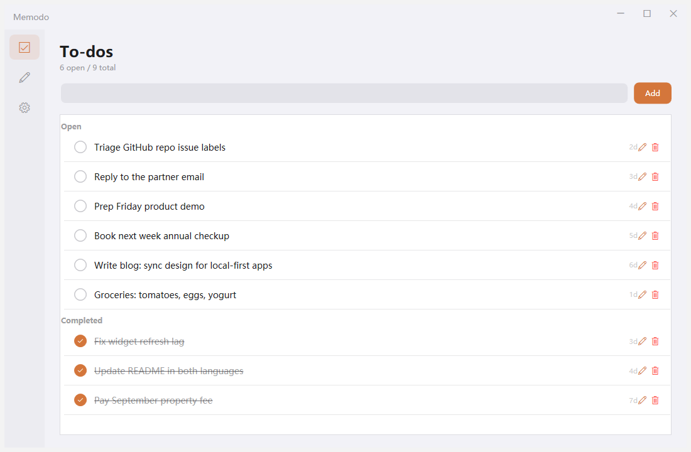
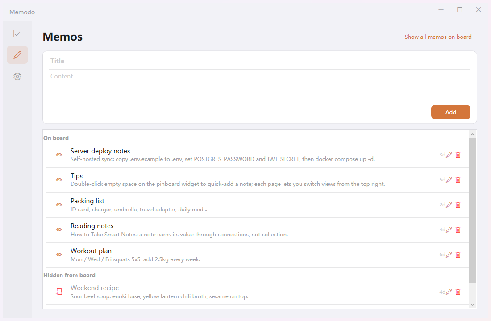
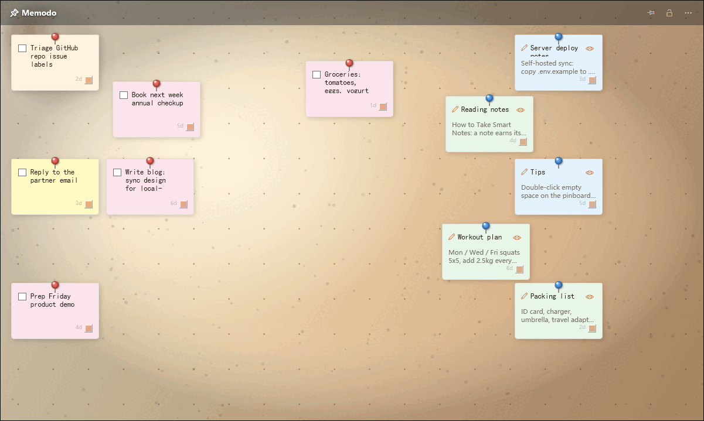
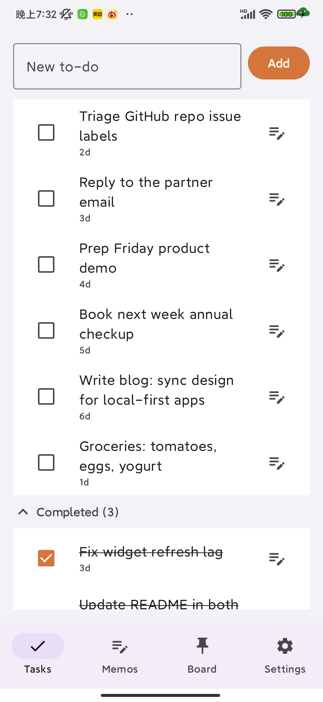
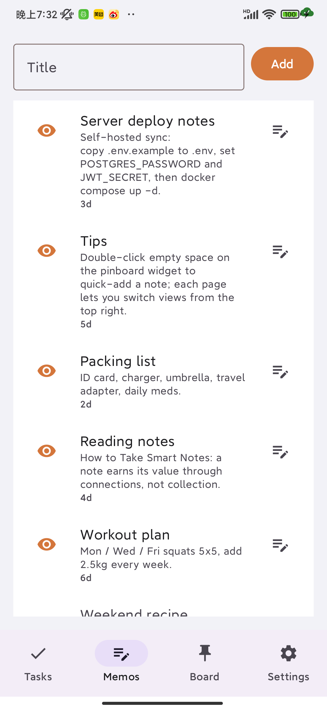
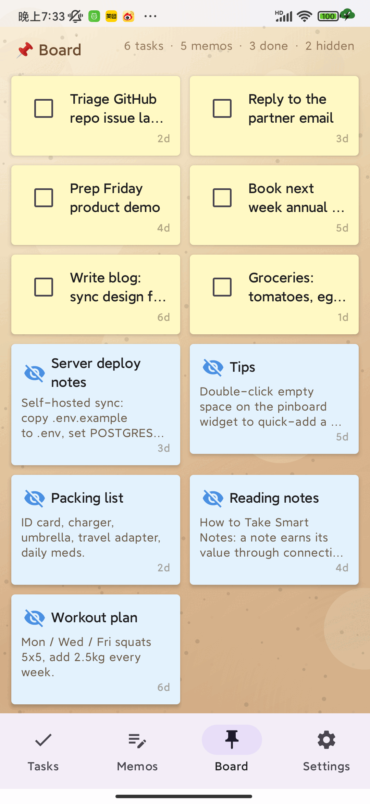

# Memodo 念念

[中文说明](README.zh-CN.md)

**A cross-platform todo & memo app with a pin-board, desktop widgets, and
pluggable sync (WebDAV or self-hosted server) protected by end-to-end encryption.**

- 📌 **Pin-board** — your open todos and visible memos rendered as pinned notes on
  a corkboard (free layout on Windows, adaptive grid on mobile).
- 🖥️ **Desktop widget** (Windows) — always-on sticky-note wall / task list on your
  desktop: check off, pin, drag, stays out of your way.
- 📱 **Android home-screen widget** — tasks with quick check-off, memo cards,
  board preview.
- 🔄 **Pluggable sync** — WebDAV (any provider, e.g. Nextcloud / 坚果云) or a
  self-hosted server you own. Auto-sync on both channels, incremental protocol.
- 🔒 **End-to-end encryption** — a passphrase you choose encrypts everything
  on-device before it leaves your machine. The cloud (WebDAV or your server)
  only ever stores ciphertext. No account, no telemetry, no key escrow.
- 🌐 **Bilingual** — full English / 简体中文 UI on both platforms.

Status: **v0.2.0** — daily-driver quality for the author; API/protocol stable
([spec](docs/PROTOCOL.md)); issues welcome.

## Status & TODO

> Live board — updated each release. Feature requests go to
> [Issues](../../issues); long-form plans live in the [roadmap](docs/ROADMAP.md).

**✅ Done — core**

| Area | What works |
|---|---|
| 📌 Pin-board | Windows free layout (drag / zoom / pin colors) · Android adaptive grid · corkboard texture |
| 🗒️ Tasks & memos | CRUD, soft-delete tombstones, due dates, share-to-memo (Android) |
| 🖥️ Windows widget | sticky-note wall / list views, topmost, opacity, tray control, autostart |
| 📱 Android widgets | task list (quick check-off), memo cards, board preview |
| 🔄 Sync | WebDAV snapshot (v3, any provider) + self-hosted server (JWT, incremental pull), auto-sync on both |
| 🔒 E2EE | AES-256-GCM + PBKDF2 (210k) · wrong/missing passphrase aborts sync protectively · credentials in OS keystore |
| 🧩 Extras | bilingual UI (EN/中文) · JSON backup export/import · tray + autostart · multi-user server isolation |

**✅ Done — quality**

- [x] Cross-device conflict matrix verified (LWW + tiebreak, tombstone propagation)
- [x] E2EE full-matrix tested: on / rotate / wrong / missing / cleared (real devices, both channels)
- [x] Server API regression suite (24 cases): auth, LWW, cursor paging, user isolation, tombstones
- [x] Security review: no plaintext secrets on disk, no telemetry, no key escrow

**🚧 In progress**

- [ ] Demo screenshots for this README
- [ ] CI — GitHub Actions: Android build · Windows build · server regression tests

**📆 Planned next** (priority order — full list in the [roadmap](docs/ROADMAP.md))

| # | Item | Why |
|---|---|---|
| 1 | Passphrase rotation re-encryption | rotate without orphaning old server rows |
| 2 | Eisenhower four-quadrant board mode | drag tasks between quadrants → auto priority |
| 3 | Windows UI accessibility (UIA) | screen readers + testability |
| 4 | WebDAV connection test wizard | one-tap setup validation |
| 5 | Recurring tasks & reminders | most-requested feature gap |

**💡 Ideas** (no promises): iOS/macOS clients · web dashboard · attachments under E2EE

## How sync works

| | WebDAV | Self-hosted server |
|---|---|---|
| Transport | one snapshot file (v3 format) | REST API + JWT |
| Conflict resolution | LWW, device-id tiebreak | server-side LWW + incremental pull |
| E2EE | whole snapshot encrypted | per-row `data` encrypted (metadata stays queryable) |
| Setup | paste URL + account + app password | `docker compose up -d`, register in-app |

Encryption is identical on both channels (AES-256-GCM + PBKDF2-SHA256, 210k
iterations) — see the [protocol spec](docs/PROTOCOL.md). **If you lose the
passphrase, cloud-side encrypted data cannot be recovered** (by design — no
backdoor, no escrow). A wrong/missing passphrase makes sync abort protectively;
local data is never touched.

## Quick start

### Server (optional — only if you choose the self-hosted channel)

```bash
git clone https://github.com/Match189/Memodo.git
cd Memodo/memodo-server
cp .env.example .env          # then edit: openssl rand -hex 32  → JWT_SECRET
docker compose up -d
# API docs at http://localhost:8000/docs
```

> ⚠️ Change `JWT_SECRET` before exposing the server beyond localhost.

### Windows client

Grab `Memodo.Windows.exe` from [Releases](../../releases) (single-file, no
installer), or build from source:

```bash
cd memodo-windows
dotnet publish -c Release -r win-x64 --self-contained true -p:PublishSingleFile=true -o publish
```

Requires Windows 10/11. Configure sync in Settings → 同步 (Sync): pick WebDAV or
server, fill in the address and account, set the **same passphrase** on every
device (or none for plaintext sync).

### Android client

Grab `app-release.apk` from [Releases](../../releases) (min SDK 24 ≈ Android 7),
or build from source:

```bash
cd memodo-android
./gradlew :app:assembleRelease   # signing config: see app/build.gradle.kts
```

## Screenshots

Windows client (to-dos · memos · pin-board widget):

<table>
  <tr>
    <td></td>
    <td></td>
    <td></td>
  </tr>
</table>

Android client (tasks · memos · board):

<table>
  <tr>
    <td></td>
    <td></td>
    <td></td>
  </tr>
</table>

中文界面预览见 [中文说明](README.zh-CN.md)。

## Building / contributing

```bash
# Windows: .NET 10 SDK         dotnet build memodo-windows
# Android: JDK 17 + SDK 35     ./gradlew assembleDebug (in memodo-android)
# Server:  Python 3.12         docker compose up (memodo-server) — no local Python needed
```

Issues and PRs welcome. For protocol changes, read
[docs/PROTOCOL.md](docs/PROTOCOL.md) first — both clients and the server must
stay interoperable.

## Security

Encryption design, threat model, and reporting policy: [SECURITY.md](SECURITY.md).
Passwords, tokens, and the E2EE passphrase are stored with OS-level protection
(DPAPI on Windows, AndroidKeyStore on Android) and never leave the device.

## License

[Apache-2.0](LICENSE) · Copyright 2026 Match189
