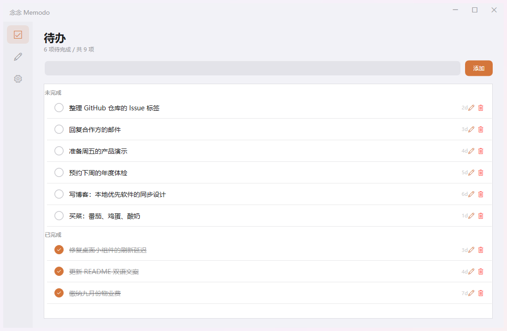
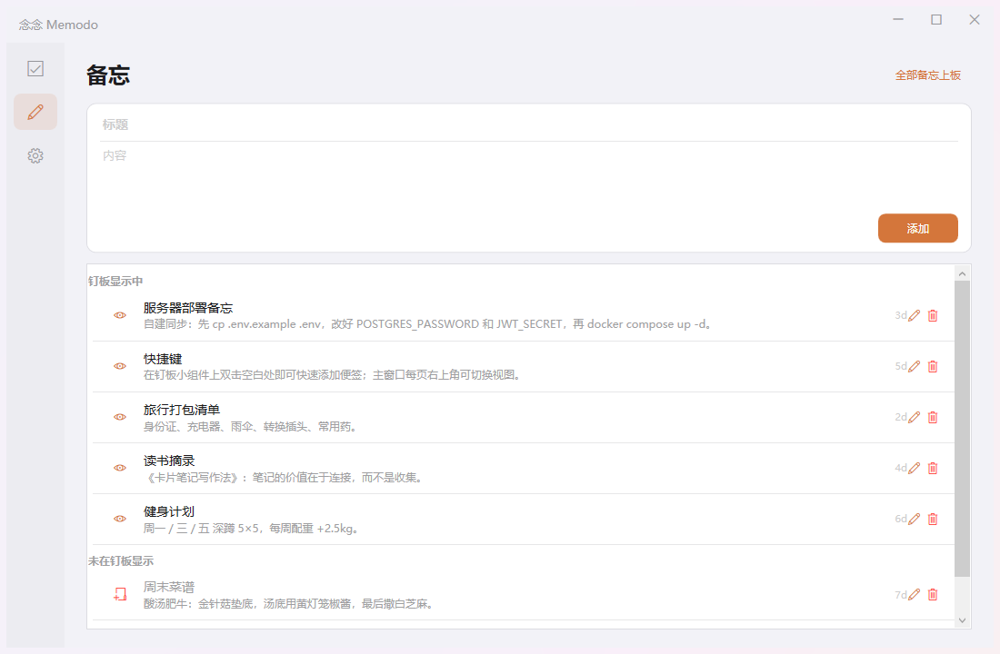
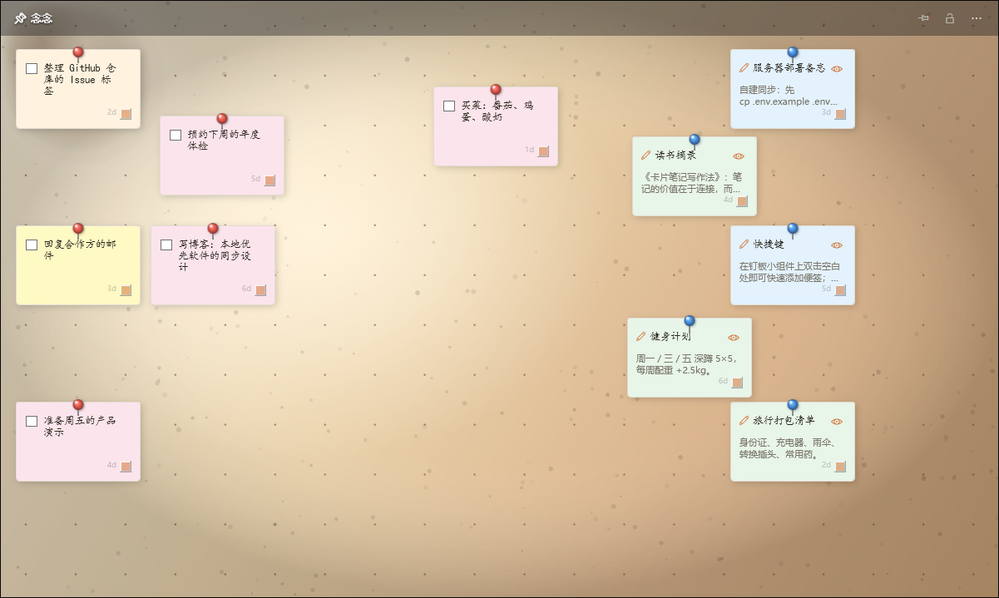
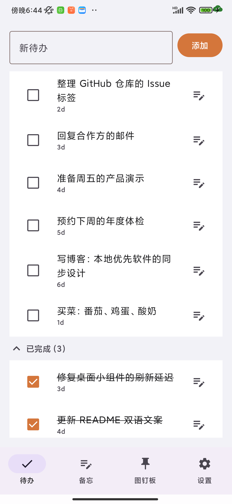
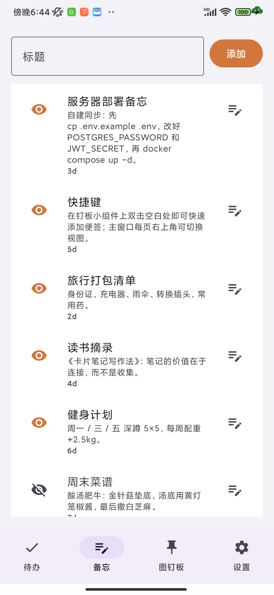
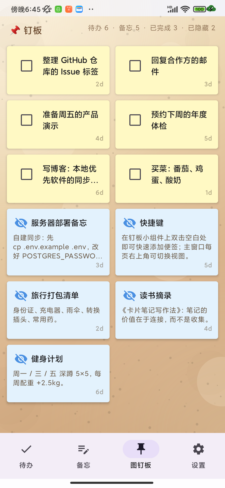

# Memodo 念念

[English](README.md)

**跨平台待办与备忘应用：图钉板 + 桌面组件 + 可插拔同步（WebDAV / 自建服务器）+ 端到端加密。**

- 📌 **图钉板** —— 未完成待办与可见备忘以便签形式钉在软木板上（Windows 自由布局，手机自适应网格）。
- 🖥️ **桌面组件**（Windows）—— 常驻桌面的便签墙 / 任务列表：勾选、钉住、拖动，不占任务栏。
- 📱 **Android 小组件** —— 待办快捷勾选、备忘卡、钉板预览。
- 🔄 **可插拔同步** —— WebDAV（Nextcloud / 坚果云等）或完全自有的自建服务器；双通道均支持自动同步与增量协议。
- 🔒 **端到端加密** —— 自选口令在设备端完成加解密，云端（网盘或服务器）只存密文。无账号、无遥测、无密钥托管。
- 🌐 **双语** —— 两端完整支持 简体中文 / English。

当前版本：**v0.2.0**。协议已稳定（[规格说明](docs/PROTOCOL.md)），欢迎反馈。

## 状态与 TODO

> 随每次发布更新。功能建议请提 [Issue](../../issues)；完整计划见[路线图](docs/ROADMAP.md)。

**✅ 已完成 —— 功能**

| 领域 | 内容 |
|---|---|
| 📌 图钉板 | Windows 自由布局（拖动/缩放/图钉色）· Android 自适应网格 · 软木纹理 |
| 🗒️ 待办与备忘 | 增删改查、软删除墓碑、到期日、系统分享转备忘（Android） |
| 🖥️ Windows 组件 | 便签墙/列表双视图、置顶、不透明度、托盘控制、开机自启 |
| 📱 Android 小组件 | 待办（快捷勾选）、备忘卡、钉板预览 |
| 🔄 同步 | WebDAV 快照（v3，任意服务商）+ 自建服务器（JWT，增量拉取），双通道自动同步 |
| 🔒 端到端加密 | AES-256-GCM + PBKDF2（21 万次迭代）· 口令错误保护性中止 · 凭据入系统密钥库 |
| 🧩 其他 | 双语界面（中/英）· JSON 备份导出导入 · 托盘 + 自启 · 服务端多用户隔离 |

**✅ 已完成 —— 质量**

- [x] 跨端冲突矩阵实测（LWW + 平局决胜、墓碑传播）
- [x] E2EE 全场景真机测试：开启/轮换/错口令/未设置/清除（双通道）
- [x] 服务端 API 回归套件（24 用例）：认证、LWW、游标分页、用户隔离、墓碑
- [x] 安全审查：明文不落盘、无遥测、无密钥托管

**🚧 进行中**

- [ ] README 演示截图
- [ ] CI（GitHub Actions：Android 构建 · Windows 构建 · 服务端回归测试）

**📆 计划中**（按优先级——完整清单见[路线图](docs/ROADMAP.md)）

| # | 事项 | 缘由 |
|---|---|---|
| 1 | 口令轮换重加密 | 换口令不产生旧密文孤儿 |
| 2 | 艾森豪威尔四象限钉板 | 象限间拖动任务 → 自动标记优先级 |
| 3 | Windows 无障碍（UIA） | 读屏支持 + 可测试性 |
| 4 | WebDAV 连接测试向导 | 一键验证配置 |
| 5 | 重复任务与提醒 |呼声最高的功能缺口 |

**💡 想法池**（未承诺）：iOS/macOS 客户端 · Web 看板 · E2EE 附件

## 同步机制

| | WebDAV | 自建服务器 |
|---|---|---|
| 传输 | 单快照文件（v3 格式） | REST API + JWT |
| 冲突裁决 | LWW + 设备号平局决胜 | 服务端 LWW + 游标增量拉取 |
| E2EE | 整包加密 | 行级加密（元数据保留可查询） |
| 配置 | 粘贴地址 + 账号 + 应用密码 | `docker compose up -d`，应用内注册 |

两通道加密一致（AES-256-GCM + PBKDF2-SHA256，21 万次迭代），详见[协议文档](docs/PROTOCOL.md)。

> ⚠️ **口令丢失 = 云端已有密文无法恢复**（按设计，无后门、无托管）。口令错误时同步会中止保护本地数据。

## 快速开始

### 服务端（可选 —— 仅自建通道需要）

```bash
git clone https://github.com/Match189/Memodo.git
cd Memodo/memodo-server
cp .env.example .env          # 编辑：openssl rand -hex 32 生成 JWT_SECRET
docker compose up -d
# 接口文档 http://localhost:8000/docs
```

> ⚠️ 对外暴露前务必修改 `JWT_SECRET`。

### Windows 客户端

从 [Releases](../../releases) 下载 `Memodo.Windows.exe`（单文件免安装），或从源码构建：

```bash
cd memodo-windows
dotnet publish -c Release -r win-x64 --self-contained true -p:PublishSingleFile=true -o publish
```

设置 → 同步：选择 WebDAV 或服务器，填写地址与账号；多台设备请填**相同口令**（不填为明文同步）。

### Android 客户端

从 [Releases](../../releases) 下载 `app-release.apk`（最低 Android 7），或从源码构建：

```bash
cd memodo-android
./gradlew :app:assembleRelease
```

## 界面预览

Windows 客户端（待办、备忘、钉板小组件）：





Android 客户端（待办、备忘、图钉板）：





English screenshots live in [README.md](README.md).

## 构建 / 参与

```bash
# Windows: .NET 10 SDK         dotnet build memodo-windows
# Android: JDK 17 + SDK 35     ./gradlew assembleDebug（memodo-android 目录）
# 服务端:  Python 3.12         docker compose up 即可，无需本机 Python
```

欢迎 issue 与 PR。改协议前请先读 [docs/PROTOCOL.md](docs/PROTOCOL.md)——两端客户端与服务端必须保持互操作。

## 安全

加密设计、威胁模型与漏洞反馈：[SECURITY.md](SECURITY.md)。密码、令牌与加密口令均经系统级保护存储（Windows DPAPI / Android Keystore），不离开设备。

## 许可

[Apache-2.0](LICENSE) · Copyright 2026 Match189
